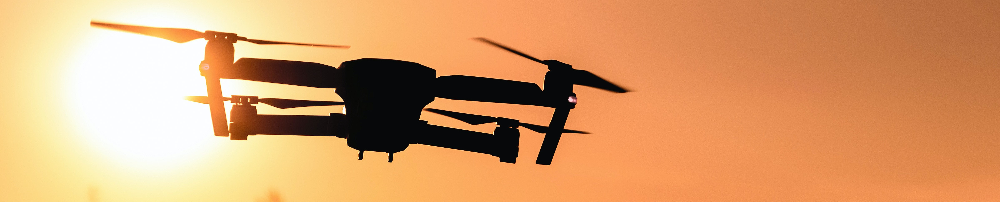
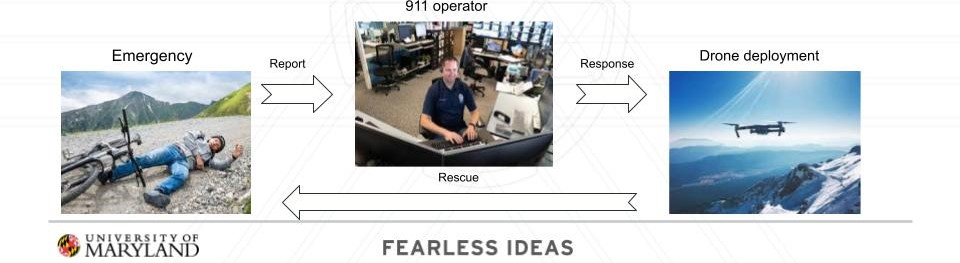
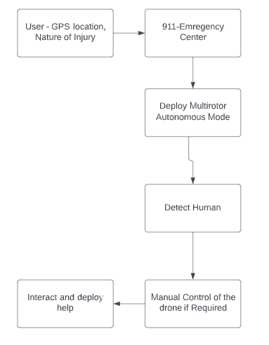
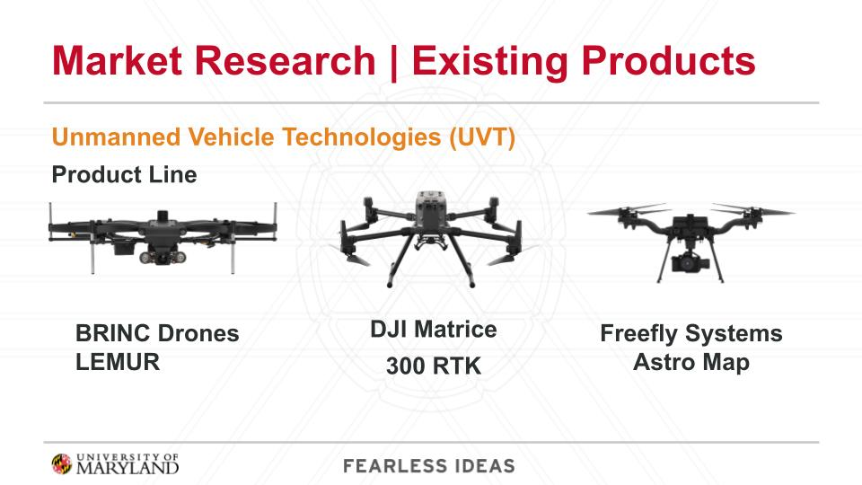
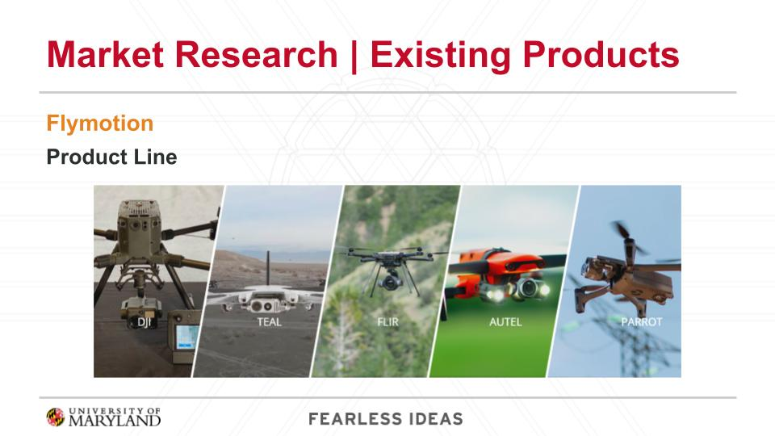
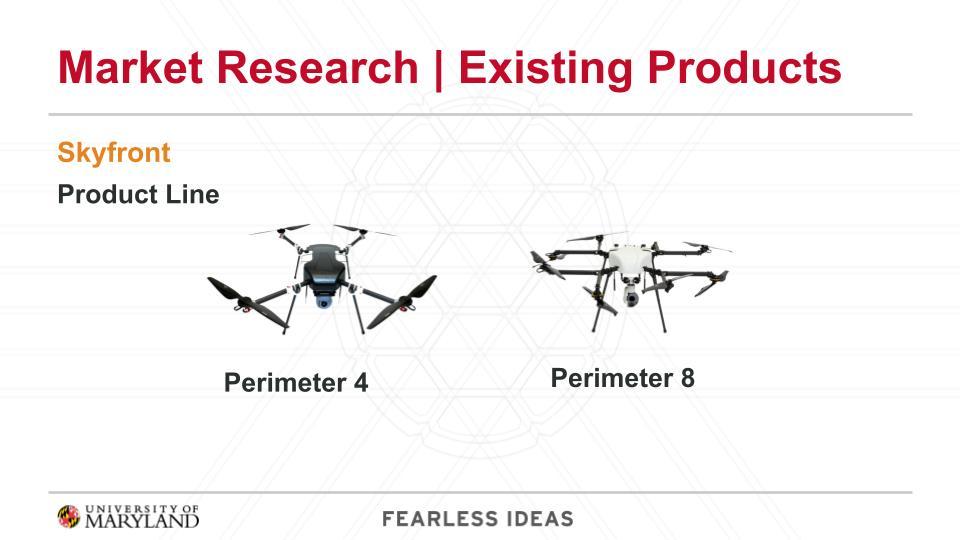

# 
Multipurpose Emergency Drone for Urban Search Assistance

MEDUSA

   
## Goal of the project
The motivation behind the project was to come up with novel ideas for a product or for a segment of the market that can bring profund impact to the sector it services. It was a product development task and we not only had to come up with an idea for the product, its mode of operation, its product architecture and a feasible Go-To-Market strategy. We also have to implement a lot of concepts from Human Robot Interaction that can help ensure that the product developed is safe for to operate and interact around humans.  
While this was a group effort and more design details of the drone are present in the eport and the presentation added, here I would like to describe my Product Management and Development contributions to this project.

## Fun Fact about the product
I have an asset that I hold dear to myself. It is my ability to come up with names and acronyms for products and services I develop. For this product, after a lot of permutations and combinations I arrived at MEDUSA. This name not only a popcultural reference to the Goddess Medusa from Greek Mythology but it also completely encompasses the product and its operation itself. 
*MEDUSA - Multipurpose Emergency Drone for Urban Search Assistance*

## The Problem at Hand
When people in remote and inaccessible areas like deserts, mountains or forests need medical assistance, help can oftentimes be difficult to get. According to the Indian National Crime Records Bureau, 24,012 people die due to delay in getting medical assistance, owing to traffic obstruction, in-accessibility of location etc. [[1]](https://www.thehindu.com/news/cities/mumbai/helping-patients-get-to-hospital-on-time/article18031300.ece "Helping People get to hospital on time, The Hindu").
This is a huge problem for ernsuring that everyone gets access to healthcare especially when in need.

## Our proposal
We propose for a new way of reaching out to the injured person before the first responders can have enough time to reach there. This will have a dual pronged benefit.
1. Provide emergency relief to the patient and interact with them
2. Assess the scene and relay the information back to the base and the first responders can come equipped with the necessities for that situation.

Why do we think that this will be an useful profuct in the first place? 
On average, emergency medical service teams take approximately 7 minutes to reach the scene after receiving a 911 call. However, in rural areas, the median time it takes for them to arrive increases to more than 14 minutes. Furthermore, almost one out of every ten cases in these settings have to wait for nearly 30 minutes for EMS personnel to arrive [[2]](https://www.ncbi.nlm.nih.gov/pmc/articles/PMC5831456/#:~:text=Emergency%20medical%20service%20units%20average,the%20arrival%20of%20EMS%20personnel. "Emergency Medical Services Response Times in Rural, Suburban, and Urban Areas, JAMA Surgery"). 

The metrics of success for this product can be broken down into two aspects. 
**Absolute**
1. Increase in patients’ rate of survival
2. Better chances at recovery due to faster access to medical care

**Abstract**
1. Lower stress levels in the patients before help arrives
2. Improved patient satisfaction scores

## Product Ideation
Basic idea is to create a system to aid the rescue and emergency response services.  
**Solution** - _MEDUSA_  A drone with the abilities to assess the scene, provide audio communication between the scene and the emergency server, and deliver basic first aid, medical refreshments like ORS etc.

 

---> Person in emergency at remote location will call 911  
---> From the Medical officials our cloud server will receive the person's location and severity of incidence  
---> Server will assign the nearest drone from the fleet of ready drones  
---> The drone carrying first aid kit will reach the location of the person   
---> It will safely land the near the person   
---> The chatbot will remotely instruct the person on how to apply the medication till the ambulance arrives  
---> Drone will autonomously come back to base station once ambulance arrives.
 
 

 

## Market Research
There are several companies currently offering similar
services out in the market. Some companies that are present
in this domain are Unmanned Vehicle Technologies(UVT),
Flymotion, Skyfront etc. The kind of domains these companies
are servicing are public safety, utility, construction, first
response, defense, law enforcement, etc. UVT and Flymotion,
use commercially available drones like Dji, Teal, etc.
Skyfront designs its own drones focusing on long-range
and endurance. Their drones, unlike others, are gas-electric
hybrid. The ballpark costs for these drones are in the range
of $10,000 - $17,000.
### Competitor 1 : Unmanned Vehicle Technologies (UVT)
*Product Design*
- They make use of publicly available drones like Dji Mavic etc. and custom tune to user’s needs
- They provide their proprietary Fleet Management services

*Area of usage*
- Public Safety
- Utilities
- Construction

 

### Competitor 2 : Flymotion
*Product Design*

- They make use of publicly available drones like Dji Mavic etc. and custom tune to user’s needs
- They provide their proprietary Fleet Management services, threat mitigation software etc.

*Area of usage*
- First Responders
- Defense
- Law enforcement and security

 

### Competitor 3 : Skyfront
*Product Design*

- They custom designed drones for long duration flights which require endurance
- Long range gas-electric hybrid drones with a run time of 5 hours and 10 Kgs of payload capacity

*Area of usage*
- US Air Force
- US Navy
- Homeland Security

 

## Product Differentiator

### Shortcomings of the competitior
-> Do the current products do the job? *More or Less, yes.*  
-> Can they be made better? *Absolutely!!*  
-> How? *Our solution is INTERACTIVE!*

**Unique Selling Point of MEDUSA**  
Our product is cost-effective. It takes into account the human factors involved in Search and rescue! It's an interactive solution to keep the patient engaged and it's a cyber-resilient system safe from threats of getting hacked.

## Business Model
Our **Go-To-Market** strategy is as follows  
* B2B service and once it's scalable, a B2A service
* Primary Target Audience
  - First Responders, 
  - United Nations to aid their relief work
* Secondary Target Audience
  - Wider public once operations are scaled
* A pay-as-you-go and choose-what-you-need subscription model for Services like Advanced Fleet Management Services, customizable features, other bells & whistles, etc.

## References
[1] Helping patients get to hospital on time, Vedika Chaubey, The Hindu – [Deaths due to delay in receiving medical advice](https://www.thehindu.com/news/cities/mumbai/helping-patients-get-to-hospital-on-time/article18031300.ece)  
[2] Emergency Medical Services Response Times in Rural, Suburban, and Urban Areas, JAMA Surgery, NIH – [Emergency Medical Services Response Times in Rural, Suburban, and Urban Areas](https://www.ncbi.nlm.nih.gov/pmc/articles/PMC5831456/#:~:text=Emergency%20medical%20service%20units%20average,the%20arrival%20of%20EMS%20personnel.) 